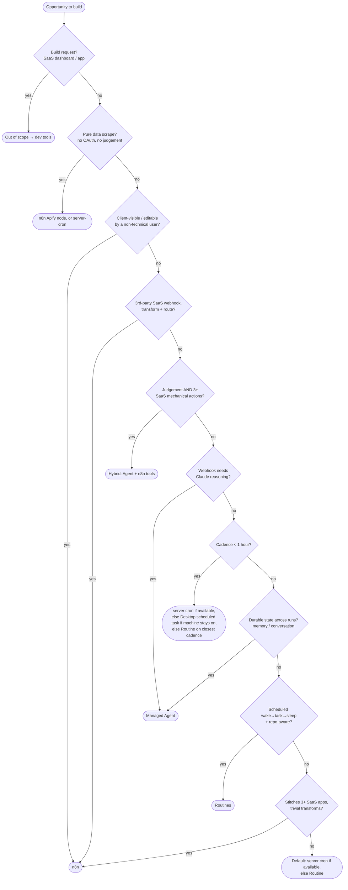

# Runtime Decision Matrix - single source of truth

Used by **all three skills** (`ai-ops-architect`, `n8n`, `managed-agents-setup`) to pick the right runtime for any given task. No duplication - both child skills reference this file.

## The 5 runtimes (+ 1 hybrid)

| # | Runtime | Identity |
|---|---------|----------|
| 1 | **n8n** | Visual SaaS-to-SaaS plumbing, 1,650 connectors, client-handoff friendly |
| 2 | **Managed Agents** | Durable cloud Claude with vault-auth'd MCP - long-lived stateful agents, billed per session-hour + tokens |
| 3 | **Routines** | Cron-scheduled cloud Claude on subscription, repo-aware, **1hr min interval** |
| 4 | **Server cron + agents-cc** | EC2-owned, sub-hourly, free at margin (only available if user has an existing server - drops out for fresh attendees) |
| 5 | **Desktop scheduled task** | Claude Desktop app: **Routines > New routine > Local**. Runs on the user's own machine, **1 min interval**, local files and tools available, no server and no open session needed. Requires the machine to be on and awake at run time - not for laptop-shut cases. |
| ★ | **Hybrid (Agent + n8n tools)** | Managed Agent calls n8n workflows as webhook tools. Agent does judgement, n8n does mechanical work. See `hybrid-pattern.md`. |

**Routines is a tier here, not a command.** This matrix picks the runtime. Which command *builds* a Routine pick - `/package-as-routine` or a plain `/schedule` - and the Phase 4 `delegate_to` downgrade that goes with it are owned by `../SKILL.md`. Do not re-derive them here.

## Decision tree (stop at first match)

```text
Q0. Build request (SaaS dashboard, mobile app, etc.)? → out-of-scope, exit and route to /feature-dev or general dev tools
Q0b. Pure data scrape (no SaaS OAuth, no judgement)?  → n8n (Apify node) OR server-cron - not Routines (no fs state)
Q1. Visible/editable by a non-technical client?       → n8n
Q2. Webhook from 3rd-party SaaS, transforms+routes?   → n8n
Q3. Needs judgement AND 3+ SaaS mechanical actions?   → HYBRID (Agent + n8n tools)
Q4. Webhook needs Claude reasoning?                   → server webhook → Managed Agent
Q5. Cadence < 1 hour?                                 → server cron (if available) else Desktop scheduled task (if the machine stays on) else Routine on closest cadence + warn
Q6. Durable state across runs (memory/conversation)?  → Managed Agents
Q7. Scheduled "wake → Claude task → sleep" + repo?    → Routines
Q8. Stitches 3+ SaaS apps with trivial transforms?    → n8n
Q9. Default                                           → server cron (if available) else Routine
```

### Visual flowchart (same logic, for non-technical tracing)



**Q3 unpacks**: if the opportunity needs LLM judgement (classify / decide / draft) AND mechanical actions across 3+ SaaS services, the hybrid pattern beats either pure runtime. The agent is cheaper because it only fires at decision points; n8n handles the deterministic rest. See `hybrid-pattern.md` for recipes. **Hybrid is offered, not forced** - the user can override to single-runtime if they want simpler.

## Comparison table

| Axis | n8n | Managed Agents | Routines | Server cron + agents-cc |
|------|-----|----------------|----------|-------------------------|
| Cost / run | Sunk sub | $0.08/sess-hr + tokens | Sub pool | Free |
| Latency | <1s | 2-5s | 5-15s | <100ms |
| Durability | 30-day exec log | Event log + resumable | Best-effort | Whatever you build |
| Schedule min | 1 min | N/A (you trigger) | **1 hour** | 1 min |
| Tools | 1,650 nodes, no Claude | Claude + remote MCP + skills | Claude Code + repo + bash | Anything bash |
| State | Per-execution | Sessions persist | Stateless (repo = state) | Filesystem |
| Best at | OAuth-heavy plumbing, client visibility | Long stateful agents, MCP fan-out | "Run prompt every morning" | Anything scriptable |
| Bad at | LLM reasoning, branching, custom logic | Sub-hourly cron, cheap one-shots | <1hr schedules, fs state | UI handoff, OAuth dance |

## Auto-detect classifier (used by ai-ops-architect Phase 4)

Before any deploy, extract 7 signals from the user's selected opportunity:

| Signal | Phrases | Bias |
|--------|---------|------|
| Client-facing | "for [client]", "they edit it" | n8n |
| Cadence | "every X min", "daily", "when X" | <1hr→cron/Desktop task/Routine, daily→Routine |
| Trigger type | "webhook", "when [SaaS] sends" | n8n or server |
| Reasoning | "summarise", "decide", "draft" | Managed Agent / Routine |
| SaaS hops | count of capitalised app names | 3+→n8n, 1→cron/Routine |
| State | "remember", "follow-up thread" | Managed Agents |
| Machine availability | "my desktop is always on", "I shut my laptop" | stays on→Desktop task, sleeps→Routine |

Priority-ordered rules:

```text
IF client-facing                                  → n8n
ELIF webhook + 2+ SaaS + no reasoning             → n8n
ELIF reasoning + 3+ mechanical SaaS actions       → HYBRID (Agent + n8n tools) - offer this
ELIF webhook + reasoning                          → server → MA (or direct MA HTTP webhook if no server)
ELIF cadence < 1hr + has server                   → server cron
ELIF cadence < 1hr + no server + machine stays on → Desktop scheduled task
ELIF cadence < 1hr + no server + machine sleeps   → Routine on closest 1hr cadence + warn
ELIF stateful conversation                        → Managed Agents
ELIF cadence ≥ 1hr + reasoning                    → Routines
ELIF cadence ≥ 1hr + bash/script                  → server cron (if available) else Desktop scheduled task
ELSE                                              → server cron OR Routine fallback
```

**Hybrid is offered, never forced.** When the orchestrator detects the hybrid signal, it presents both options to the user: "Pure managed agent (simpler, $5-10/day) OR hybrid (cheaper at $1-3/day, agent calls n8n workflows as tools, more reliable for mechanical work)." The user picks. Default suggestion is hybrid for opportunities flagged `runtime: hybrid`.

## Server-cron availability gate

Server cron + agents-cc is **only available** if the user has an EC2 (or equivalent) server with the agents-cc framework installed. The `ai-ops-architect` Phase 0 detects this - if not present, it removes server-cron from the runtime menu and routes those decisions to a Desktop scheduled task (sub-hourly or local-file work, when the machine is reliably on and awake) or to Routines on the closest cadence.

For workshop attendees with no server, the matrix collapses to **4 runtimes** (n8n / Managed Agents / Routines / Desktop scheduled task). A Desktop scheduled task is the server-less answer for sub-hourly cadence and local-file work; it is not an answer when the machine sleeps at run time - a shut laptop overnight is the case that still belongs on Routines.

## Anti-patterns (what to refuse)

- **Anything Xero in n8n** → server scripts + MCP. Never Xero in n8n. (Three-layer Xero setup is fragile, do not fork.)
- **Sub-hourly Routines** → hard floor 1hr, fall back to server-cron, or a Desktop scheduled task when the machine stays on, else warn user.
- **Bulk destructive ops in n8n** → require explicit names + IDs, only operate on `claude-managed`-tagged workflows.
- **OAuth heavy services in Managed Agents without Rube** → use Rube as the OAuth gateway; direct MCPs only when Rube doesn't cover the service.

## Cost reference (5 worked patterns at typical SMB volume)

| Pattern | Volume | Runtime | Marginal/mo |
|---|---|---|---|
| Lead capture (Form→n8n→CRM) | 200/mo | n8n + CRM (sunk) | ~$0 |
| Daily Slack digest | 30/mo | Routines | ~$0 (subscription pool) |
| Voice → action | 50/mo | Webhook → MA $0.08/hr × ~5hr | ~$10 |
| Long research crawl | 4/mo, 4hr each | MA | ~$15 |
| Stripe sub events | 30/mo | n8n + Telegram | ~$0 |

n8n.cloud Starter is **$24/mo**. Managed Agents free tier exists; assume $0-50/mo until volume kicks in.

## When to update this file

This is a living document. Update it when:
- A new runtime joins the stack (e.g. an MCP-based scheduler)
- Pricing changes materially on any provider
- A worked pattern proves a different runtime is better than originally classified

All edits go through PR review - both child skills depend on it being correct.
